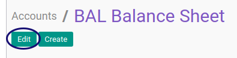

# Memodifikasi Account

*(Tidak ada instruksi khusus)*

## B. LANGKAH KERJA

1. Buka menu **Accounting -> Configuration -> Accounts -> Account**. Abaikan jika sudah berada pada menu yang dimaksud.
2. Buka data cash flow code yang akan dimodifikasi. Abaikan jika data sudah dibuka.
3. Klik tombol **Edit** pada bagian atas-kiri form.

4. Ubah **[Account Code](./penjelasan.md#field-code)** jika diperlukan. Harus diisi.
5. Ubah **[Account Name](./penjelasan.md#field-name)** jika diperlukan. Harus diisi.
6. Pilih **[Parent](./penjelasan.md#field-parent-id)** jika diperlukan. Tidak Harus diisi.
7. Pilih **[Internal Type](./penjelasan.md#field-type)** jika diperlukan. Harus diisi.
8. Pilih **[Direct Cash FLow](./penjelasan.md#field-direct-cashflow-id)** jika diperlukan. Tidak Harus diisi.
9. Pilih **[Indirect Cash FLow](./penjelasan.md#field-indirect-cashflow-id)** jika diperlukan. Tidak Harus diisi.
10. Pilih **[Account Type](./penjelasan.md#field-account-type)** jika diperlukan. Harus diisi.
11. Pilih **[Asset Category](./penjelasan.md#field-category-id)** jika diperlukan. Tidak Harus diisi.
12. Centang **[Active](./penjelasan.md#field-active)** jika statusnya aktif.
13. Centang **[Centralized](./penjelasan.md#field-centralized)** jika akun akan dipusatkan jadi satu.
14. Pilih **[Default Operating Unit](./penjelasan.md#field-operating-unit-id)** jika diperlukan. Tidak Harus diisi.
15. Pilih **[Default Taxes](./penjelasan.md#field-tax-ids)** jika diperlukan. Tidak Harus diisi.
16. Centang **[Allow Reconciliation](./penjelasan.md#field-reconcile)** jika akun diperbolehkan untuk direkonsiliasi.
17. Pilih **[Secondary Currency](./penjelasan.md#field-currency-id)** jika diperlukan. Tidak Harus diisi.
18. Pilih **[Outgoing Currency Rate](./penjelasan.md#field-currency-mode)** jika diperlukan. Harus diisi jika secondary currency ada isian.
19. Ubah **[Internal Note](./penjelasan.md#field-note)** jika diperlukan. Tidak Harus diisi.
20. Klik tombol **Save** pada bagian atas-kiri form.

## C. OUTPUT

* Data *Account* akan tersimpan sesuai dengan perubahan.

## Chapter

- [Konfigurasi](../../konfigurasi.md)
- [Account](../account.md)
- [Penjelasan Account](penjelasan.md)
- [Membuat Account](membuat.md)
- [Menghapus Account](menghapus.md)
