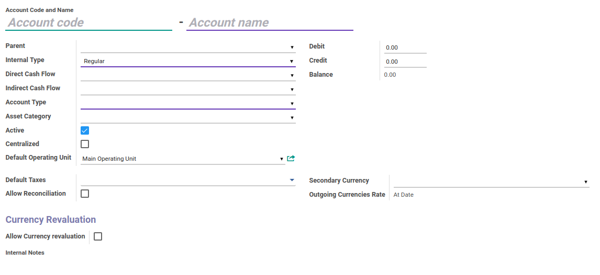

# Penjelasan Account

### <a name="bagian-header">HEADER</a>

#### <a name="field-code">Account Code</a>

Kode Akun

#### <a name="field-name">Account Name</a>

Nama Akun

#### <a name="field-parent-id">Parent</a>

Parent Akun

#### <a name="field-type">Internal Type</a>

Internal Tipe Akun. Terbagi atas beberapa internal tipe, yaitu: 
* View
* Reqular
* Receivable
* Payable
* Liquidity
* Consolidation
* Closed

#### <a name="field-direct-cashflow-id">Direct Cash Flow</a>

Cash Flow Code dengan tipe direct

#### <a name="field-indirect-cashflow-id">Indirect Cash Flow</a>

Cash Flow Code dengan tipe indirect

#### <a name="field-account-type">Account Type</a>

Tipe Akun

#### <a name="field-asset-category-id">Asset Category</a>

Kategori Asset

#### <a name="field-active">Active</a>

Sebagai penanda apakah data adalah aktif/non-aktif

#### <a name="field-centralized">Centralized</a>

Sebagai penanda apakah akun akan dipusatkan jadi satu

#### <a name="field-operating-unit-id">Default Operating Unit</a>

Sebagai nilai default operating unit apabila akun terpilih. 
Hanya pengguna yang tergabung dalam group **Multi Operating Units** yang dapat melihat isian ini.

#### <a name="field-tax-ids">Default Taxes</a>

Sebagai nilai default pajak apabila akun terpilih

#### <a name="field-reconcile">Allow Reconciliation</a>

Sebagai informasi apakah akun dapat direkonsiliasi atau tidak

#### <a name="field-debit">Debit</a>

Informasi nilai debit dari akun

#### <a name="field-credit">Credit</a>

Informasi nilai kredit dari akun

#### <a name="field-balance">Balance</a>

Informasi nilai balance dari akun

#### <a name="field-currency-id">Secondary Currency</a>

Untuk menentukan Mata Uang kedua untuk akun

#### <a name="field-currency-mode">Outgoing Currencies Rate</a>

Menentukan Rate dari Outgoing Currency. Hanya jika secondary currency ada isian. 
Terbagi atas 2, yaitu: 
* At Date
* Average Rate

#### <a name="field-note">Internal Notes</a>

Catatan Internal

## Chapter
- [Konfigurasi](../../konfigurasi.md)
- [Account](../account.md)
- [Membuat Account](membuat.md)
- [Memodifikasi Account](memodifikasi.md)
- [Menghapus Account](menghapus.md)
