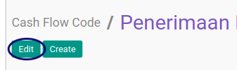

# Memodifikasi Cash Flow Code

## A. INPUT

*(Tidak ada instruksi khusus)*

## B. LANGKAH KERJA

1. Buka menu **Accounting -> Configuration -> Accounts -> Cash Flow Code**. Abaikan jika sudah berada pada menu yang dimaksud.
2. Buka data cash flow code yang akan dimodifikasi. Abaikan jika data sudah dibuka.
3. Klik tombol **Edit** pada bagian atas-kiri form.

4. Ubah **[Name](./penjelasan.md#field-name)** jika diperlukan. Harus diisi.
5. Ubah **[Active](./penjelasan.md#field-active)** jika diperlukan..
6. Ubah **[Type](./penjelasan.md#field-type)** jika diperlukan. Harus diisi.
7. Ubah **[Description](./penjelasan.md#field-description)** jika diperlukan. Tidak Harus diisi.
8. Klik tombol **Save** pada bagian atas-kiri form.

## C. OUTPUT

* Data *Cash flow code* akan tersimpan sesuai dengan perubahan.

## Chapter
- [Konfigurasi](../../konfigurasi.md)
- [Cash Flow Code](../cash-flow-code.md)
- [Membuat Cash Flow Code](membuat.md)
- [Penjelasan Cash Flow Code](penjelasan.md)
- [Menghapus Cash Flow Code](menghapus.md)
