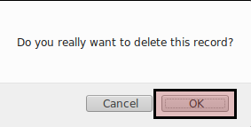

# Menghapus Cash Flow Code

## A. INPUT

*(Tidak ada instruksi khusus)*

## B. LANGKAH KERJA

1. Buka menu **Accounting -> Configuration -> Accounts -> Cash Flow Code**. Abaikan jika sudah berada pada menu yang dimaksud.
2. Buka data cash flow code yang akan dihapus. Abaikan jika data sudah dibuka.
3. Klik tombol **More** pada bagian atas-kiri form.

4. Klik tombol **Delete** pada drop-down yang muncul pada tombol **More**.

5. Klik tombol **Ok** pada dialog konfirmasi penghapusan yang muncul.

## C. OUTPUT

* Data cash flow code akan terhapus.

## Chapter
- [Konfigurasi](../../konfigurasi.md)
- [Cash Flow Code](../cash-flow-code.md)
- [Membuat Cash Flow Code](membuat.md)
- [Memodifikasi Cash Flow Code](memodifikasi.md)
- [Penjelasan Cash Flow Code](penjelasan.md)
