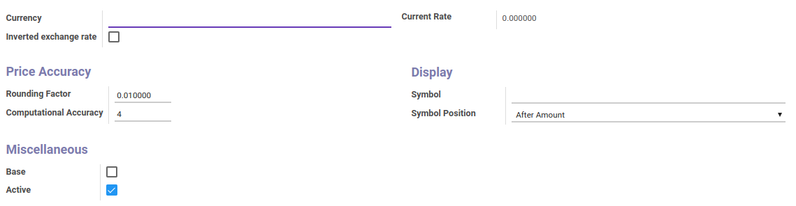
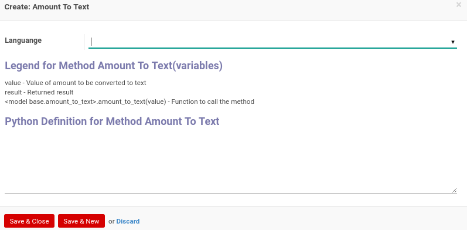

# Currency

### <a name="bagian-header">HEADER</a>

#### <a name="field-name">Currency</a>

Nama Mata Uang

#### <a name="field-rate-inverted">Inverted exchange rate</a>

To Do

#### <a name="field-rate-silent">Current Rate</a>

To Do

#### <a name="field-rounding">Rounding Factor</a>

Pembulatan faktor

#### <a name="field-accuracy">Computational Accuracy</a>

To Do

#### <a name="field-symbol">Symbol</a>

Symbol mata uang yang akan digunakan

#### <a name="field-position">Symbol Position</a>

Mendefinisikan posisi symbol mata uang. Posisi dibagi atas 2, yaitu: 
* After Amount
* Before Amount

#### <a name="field-base">Base</a>

To Do

#### <a name="field-active">Active</a>

Sebagai penanda apakah data adalah aktif/non-aktif

### <a name="detail-currency-rate">CURRENCY RATE</a>

#### <a name="field-detail-currency-rate-name">Date</a>

Tanggal rate

#### <a name="field-detail-currency-rate-rate">Rate</a>

Nilai rate yang akan digunakan

### <a name="detail-amount-to-text">AMOUNT TO TEXT</a>

#### <a name="field-detail-amount-to-text-lang-id">Languange</a>

Bahasa yang akan digunakan

#### <a name="field-detail-amount-to-text-python-amount2text">Python Definition for Method Amount To Text</a>

Fungsi python untuk generate amount to text