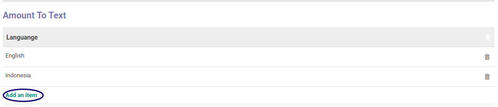
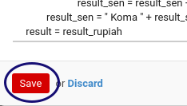

# Membuat Amount To Text

*(Instruksi kerja ini merupakan sub instruksi dari [Memodifikasi Currency](./memodifikasi.md). Instruksi kerja ini tidak bisa berdiri sendiri)*

## A. INPUT

*(Tidak ada instruksi khusus)*

## B. LANGKAH KERJA

1. Klik label **Add an Item** pada tab **Amount to Text**

2. Pilih **[Language](./penjelasan.md#field-detail-amount-to-text-lang-id)**. Harus diisi.
3. Isi **[Python Definition for Method Amount To Text](./penjelasan.md#field-detail-amount-to-text-python-amount2text)**. Harus diisi.
4. Klik tombol **Save** pada bagian bawah kiri form.

5. Lanjutkan [langkah ke-16 Instruksi Kerja Memodifikasi Currency](./memodifikasi.md#l16).

## C. OUTPUT

* Data amount to text akan tersimpan.

## Chapter

- [Konfigurasi](../../konfigurasi.md)
- [Currency](../currency.md)
- [Penjelasan Currency](penjelasan.md)
- [Memodifikasi Currency](memodifikasi.md)
- [Membuat Rate Currency](membuat-rate.md)
- [Memodifikasi Rate Currency](memodifikasi-rate.md)
- [Menghapus Rate Currency](menghapus-rate.md)
- [Memodifikasi Amount To Text](memodifikasi-amount.md)
- [Menghapus Amount To Text](menghapus-amount.md)
