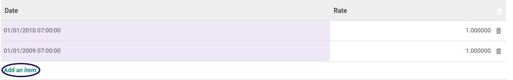

# Membuat Rate Currency

*(Instruksi kerja ini merupakan sub instruksi dari [Memodifikasi Currency](./memodifikasi.md). Instruksi kerja ini tidak bisa berdiri sendiri)*

## A. INPUT

*(Tidak ada instruksi khusus)*

## B. LANGKAH KERJA

1. Klik label **Add an Item** pada tab **Rate Currency**

2. Isi **[Date](./penjelasan.md#field-detail-currency-rate-date)**. Harus diisi.
3. Isi **[Rate](./penjelasan.md#field-detail-currency-rate-rate)**. Harus diisi.
4. Lanjutkan [langkah ke-13 Instruksi Kerja Memodifikasi Currency](./memodifikasi.md#l13).

## C. OUTPUT

* Data rate akan tersimpan.

## Chapter

- [Konfigurasi](../../konfigurasi.md)
- [Currency](../currency.md)
- [Penjelasan Currency](penjelasan.md)
- [Memodifikasi Currency](memodifikasi.md)
- [Memodifikasi Rate Currency](memodifikasi-rate.md)
- [Menghapus Rate Currency](menghapus-rate.md)
- [Membuat Amount To Text](membuat-amount.md)
- [Memodifikasi Amount To Text](memodifikasi-amount.md)
- [Menghapus Amount To Text](menghapus-amount.md)
