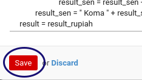

# Memodifikasi Amount To Text
*(Instruksi kerja ini merupakan sub instruksi dari [Memodifikasi Currency](./memodifikasi.md). Instruksi kerja ini tidak bisa berdiri sendiri)*

## A. INPUT

*(Tidak ada instruksi khusus)*

## B. LANGKAH KERJA

1. Letakkan kursor pada data yang akan diubah. Abaikan jika sudah berada pada data yang dimaksud.
2. Double Klik data tersebut pada tab **Amount to Text**

3. Ubah **[Language](./penjelasan.md#field-detail-amount-to-text-lang-id)** jika diperlukan. jika diperlukan. Harus diisi.
4. Ubah **[Python Definition for Method Amount To Text](./penjelasan.md#field-detail-amount-to-text-python-amount2text)** jika diperlukan.. Harus diisi.
5. Klik tombol **Save** pada bagian bawah kiri form.

6. Lanjutkan [langkah ke-16 Instruksi Kerja Memodifikasi Currency](./memodifikasi.md#l16).

## C. OUTPUT

* Data amount to text akan tersimpan sesuai perubahan.

## Chapter

- [Konfigurasi](../../konfigurasi.md)
- [Currency](../currency.md)
- [Penjelasan Currency](penjelasan.md)
- [Memodifikasi Currency](memodifikasi.md)
- [Membuat Rate Currency](membuat-rate.md)
- [Memodifikasi Rate Currency](memodifikasi-rate.md)
- [Menghapus Rate Currency](menghapus-rate.md)
- [Membuat Amount To Text](membuat-amount.md)
- [Menghapus Amount To Text](menghapus-amount.md)
