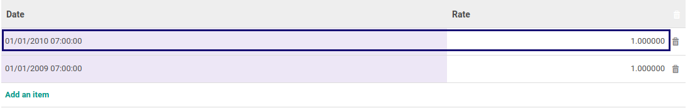

# Memodifikasi Rate Currency

*(Instruksi kerja ini merupakan sub instruksi dari [Memodifikasi Currency](./memodifikasi.md). Instruksi kerja ini tidak bisa berdiri sendiri)*

## A. INPUT

*(Tidak ada instruksi khusus)*

## B. LANGKAH KERJA

1. Letakkan kursor pada data yang akan dimodifikasi. Abaikan jika sudah berada pada data yang dimaksud.
2. Klik pada data yang akan dimodifikasi.

3. Ubah **[Date](./penjelasan.md#field-detail-currency-rate-date)** jika diperkukan.
4. Ubah **[Rate](./penjelasan.md#field-detail-currency-rate-rate)** jika diperkukan.
5. Lanjutkan [langkah ke-13 Instruksi Kerja Memodifikasi Currency](./memodifikasi.md#l13).

## C. OUTPUT

* Data rate akan tersimpan sesuai perubahan.

## Chapter

- [Konfigurasi](../../konfigurasi.md)
- [Currency](../currency.md)
- [Penjelasan Currency](penjelasan.md)
- [Memodifikasi Currency](memodifikasi.md)
- [Membuat Rate Currency](membuat-rate.md)
- [Menghapus Rate Currency](menghapus-rate.md)
- [Membuat Amount To Text](membuat-amount.md)
- [Memodifikasi Amount To Text](memodifikasi-amount.md)
- [Menghapus Amount To Text](menghapus-amount.md)
