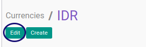
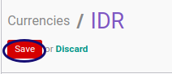

# Memodifikasi Currency

## A. INPUT

*(Tidak ada instruksi khusus)*

## B. LANGKAH KERJA

1. Buka menu **Accounting -> Configuration -> Miscellaneous -> Currencies**. Abaikan jika sudah berada pada menu yang dimaksud.
2. Buka data currency yang akan dimodifikasi. Abaikan jika data sudah dibuka.
3. Klik tombol **Edit** pada bagian atas-kiri form.

4. Ubah **[Currency](./penjelasan.md#field-name)** jika diperlukan. Harus diisi.
5. Ubah **[Inverted Exchange Rate](./penjelasan.md#field-rate-inverted)** jika diperlukan.
6. Ubah **[Current Rate](./penjelasan.md#field-rate-current)** jika diperlukan.
7. Ubah **[Rounding Factor](./penjelasan.md#field-rounding)** jika diperlukan.
8. Ubah **[Computational Accuracy](./penjelasan.md#field-accuracy)** jika diperlukan.
9. Ubah **[Symbol](./penjelasan.md#field-symbol)** jika diperlukan.
10. Ubah **[Symbol Position](./penjelasan.md#field-position)** jika diperlukan.
11. Ubah **[Base](./penjelasan.md#field-base)** jika diperlukan.
12. Ubah **[Active](./penjelasan.md#field-active)** jika diperlukan.
13. **[Currency Rate](./penjelasan.md#detail-currency-rate)** untuk mengisi rate currency.
14. <a name="l13">[Membuat](./membuat-rate.md)/[Memodifikasi](./memodifikasi-rate.md)/[Menghapus](./menghapus-rate.md) **Rate Currency**</a>. Ulangi langkah ini sampai **Rate Currency** yang diperlukan sesuai dengan keinginan.
15. **[Amount To Text](./penjelasan.md#detail-amount-to-text)**.
16. <a name="l16">[Membuat](./membuat-amount.md)/[Memodifikasi](./memodifikasi-amount.md)/[Menghapus](./menghapus-amount.md) **Amount To Text**</a>. Ulangi langkah ini sampai **Amount To Text** yang diperlukan sesuai dengan keperluan.
17. Klik tombol **Save** pada bagian atas-kiri form.

## C. OUTPUT

* Data *Currency* akan tersimpan sesuai dengan perubahan.

## Chapter

- [Konfigurasi](../../konfigurasi.md)
- [Currency](../currency.md)
- [Penjelasan Currency](penjelasan.md)
- [Membuat Rate Currency](membuat-rate.md)
- [Memodifikasi Rate Currency](memodifikasi-rate.md)
- [Menghapus Rate Currency](menghapus-rate.md)
- [Membuat Amount To Text](membuat-amount.md)
- [Memodifikasi Amount To Text](memodifikasi-amount.md)
- [Menghapus Amount To Text](menghapus-amount.md)
