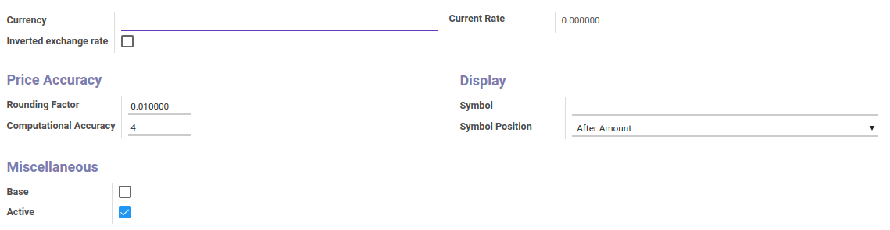
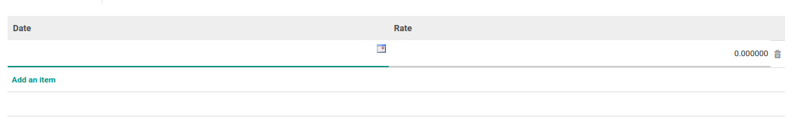
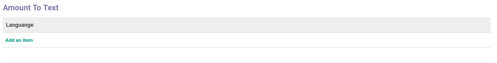
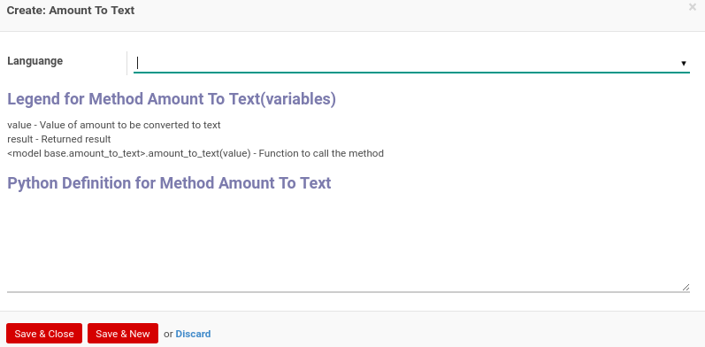

# Penjelasan Currency

### <a name="bagian-header">HEADER</a>

#### <a name="field-name">Currency</a>

Nama Mata Uang

#### <a name="field-rate-inverted">Inverted exchange rate</a>

Menentukan cara menghitung nilai tukar mata uang. Jika dicentang akan dihitung secara berkebalikan

#### <a name="field-rate-current">Current Rate</a>

Nilai tukar/rate saat ini

#### <a name="field-rounding">Rounding Factor</a>

Pembulatan faktor

#### <a name="field-accuracy">Computational Accuracy</a>

Nilai akurasi perhitungan

#### <a name="field-symbol">Symbol</a>

Symbol mata uang yang akan digunakan

#### <a name="field-position">Symbol Position</a>

Mendefinisikan posisi symbol mata uang. Posisi dibagi atas 2, yaitu: 
* After Amount
* Before Amount

#### <a name="field-base">Base</a>

Menentukan apakah mata uang ini merupakan base perhitungan.

#### <a name="field-active">Active</a>

Sebagai penanda apakah data adalah aktif/non-aktif

### <a name="detail-currency-rate">CURRENCY RATE</a>

#### <a name="field-detail-currency-rate-date">Date</a>

Tanggal rate

#### <a name="field-detail-currency-rate-rate">Rate</a>

Nilai tukar/rate yang akan digunakan berdasarkan tanggal rate

### <a name="detail-amount-to-text">AMOUNT TO TEXT</a>

Membuat fungsi untuk merubah nilai amount menjadi teks/text.

#### <a name="field-detail-amount-to-text-lang-id">Languange</a>

Bahasa yang akan digunakan

#### <a name="field-detail-amount-to-text-python-amount2text">Python Definition for Method Amount To Text</a>

Fungsi python untuk generate amount to text

## Chapter

- [Konfigurasi](../../konfigurasi.md)
- [Currency](../currency.md)
- [Memodifikasi Currency](modifikasi.md)
- [Membuat Rate Currency](membuat-rate.md)
- [Memodifikasi Rate Currency](memodifikasi-rate.md)
- [Menghapus Rate Currency](menghapus-rate.md)
- [Membuat Amount To Text](membuat-amount.md)
- [Memodifikasi Amount To Text](memodifikasi-amount.md)
- [Menghapus Amount To Text](menghapus-amount.md)
