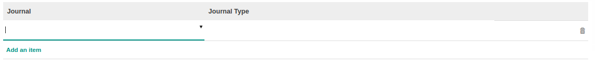

# Fiscal Period

### <a name="bagian-header">HEADER</a>

#### <a name="field-name">Period Name</a>

Nama Periode

#### <a name="field-code">Code</a>

Kode Periode

#### <a name="field-fiscalyear-id">Fiscal Year</a>

Nama Fiscal Year

#### <a name="field-detail-periode-special">Opening/Closing Period</a>

Sebagai informasi apakah data periode merupakan Opening atau Closing dari Fiscal Year

#### <a name="field-duration">Duration</a>

Durasi (**Format:** *Tanggal Mulai - Tanggal Akhir*) periode akan berjalan

### <a name="bagian-detail-journal">DETAIL JOURNALS</a>

#### <a name="field-journal-id">Journal</a>

Journal yang akan tersedia pada periode

#### <a name="field-journal-period-ids">Journal Type</a>

Tipe dari journal terpilih
