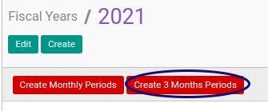

# Generate Fiscal Period Per 3 Bulan

Proses ini dilakukan untuk membuat data periode fiskal (Fiscal Period) per bulan secara otomatis pada suatu tahun fiskal (fiscal year).
Proses ini adalah proses **yang sering digunakan** untuk mempermudah dan mempercepat pembuatan periode fiskal.

## A. INPUT

*(Data Fiscal year sudah diinput dan berstatus open)*

## B. LANGKAH KERJA

1. Buka menu **Accounting -> Configuration -> Periods -> Fiscal Years**. Abaikan jika sudaah berada pada menu yang dimaksud.
2. Buka data fiscal year yang akan dibuat periodenya. Abaikan jika data sudah dibuka.
3. Klik Tombol **Create 3 Months Periods** di bagian atas.

## C. OUTPUT

*Data fiscal period per 3 bulan pada tahun fiscal akan tersimpan secara otomatis*

## Chapter
- [Konfigurasi](../../konfigurasi.md)
- [Fiscal Period](../fiscal-period.md)
- [Penjelasan Fiscal Period](penjelasan.md)
- [Generate Fiscal Period per bulan](generate-monthly.md)
- [Membuat Fiscal Period secara manual](membuat.md)
- [Memodifikasi Fiscal Period](memodifikasi.md)
- [Menghapus Fiscal Period](menghapus.md)
