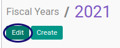
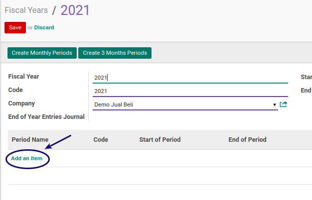
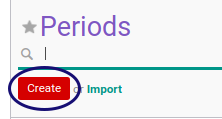
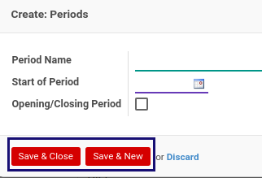

# Membuat Fiscal Period secara manual

Proses ini dilakukan untuk membuat data periode fiscal secara manual.
Proses ini **hampir tidak digunakan** karena sudah ada proses generate periode fiscal secara bulanan dan per 3 bulan.
Namun tetap akan dijelaskan bagaimana cara membuat periode fiskal secara manual.

## A. INPUT

*(Data Fiscal year sudah diinput dan berstatus open)*

## B. LANGKAH KERJA

1. Ada 2 cara untuk masuk ke menu fiscal Period

    - Melalui menu fiscal years

        1. Buka menu **Accounting -> Configuration -> Periods -> Fiscal Years**
        2. Pilih data fiscal year yang akan dibuat periodenya
        3. Klik Edit

        

        4. Pada tab period klik add an item

        

    - Melalui menu fiscal period

        1. Buka menu **Accounting -> Configuration -> Periods -> Periods**
        2. Klik tombol **Create** pada bagian atas-kiri form.

        

3. Isi **[Periode Name](./penjelasan.md#field-name)**. Harus diisi.
4. Isi **[Code](./penjelasan.md#field-code)**. Harus diisi.
5. Pilih **[Fiscal Year](./penjelasan.md#field-fiscal-year-id)**. Harus diisi.
6. Centang **[Opening/Closing Period](./penjelasan.md#field-detail-periode-special)**.
7. Isi **[Duration](./penjelasan.md#field-duration)**. Harus diisi.
8. Saat menyimpan  

    - Melalui menu fiscal years

        1. Klik **Save & Close** atau **Save & New** pada bagian bawah

            

        2. Setelah selesai klik **Save** pada bagian atas

            

    - Melalui menu fiscal period

        1. Klik tombol **Save** pada bagian atas-kiri form.

            

## C. OUTPUT

*(Data akan tersimpan)*

## Chapter
- [Konfigurasi](../../konfigurasi.md)
- [Fiscal Period](../fiscal-period.md)
- [Penjelasan Fiscal Period](penjelasan.md)
- [Generate Fiscal Period Per Bulan](generate-monthly.md)
- [Generate Fiscal Period per 3 Bulan](generate-3monthly.md)
- [Memodifikasi Fiscal Period](memodifikasi.md)
- [Menghapus Fiscal Period](menghapus.md)
