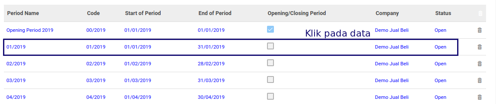

# Memodifikasi Fiscal Period

## A. INPUT

*(Data Fiscal year sudah diinput dan berstatus open)*

## B. LANGKAH KERJA

1. Ada 2 cara untuk memodifikasi fiscal Period

    - Melalui menu fiscal years

        1. Buka menu **Accounting -> Configuration -> Periods -> Fiscal Years**
        2. Pilih data fiscal year yang akan dimodifikasi
        3. Klik Edit

        

        4. Double klik pada data yang akan dimodifikasi

        

    - Melalui menu fiscal period

        1. Buka menu **Accounting -> Configuration -> Periods -> Period**
        2. Pilih data fiscal period yang akan dimodifikasi
        3. Klik tombol **Edit** pada bagian atas-kiri form.

        

3. Sesuaikan **[Periode Name](./penjelasan.md#field-name)** jika diperlukan. Harus diisi.
4. Sesuaikan **[Code](./penjelasan.md#field-code)** jika diperlukan. Harus diisi.
5. Sesuaikan **[Fiscal Year](./penjelasan.md#field-fiscal-year-id)** jika diperlukan. Harus diisi.
6. Sesuaikan **[Opening/Closing Period](./penjelasan.md#field-detail-periode-special)** jika diperlukan.
7. Sesuaikan **[Duration](./penjelasan.md#field-duration)** jika diperlukan. Harus diisi.
8. Klik tombol **Save** pada bagian atas-kiri form untuk menyimpan.

    

## C. OUTPUT

*(Data akan tersimpan)*

## Chapter
- [Konfigurasi](../../konfigurasi.md)
- [Fiscal Period](../fiscal-period.md)
- [Penjelasan Fiscal Period](penjelasan.md)
- [Generate Fiscal Period Per Bulan](generate-monthly.md)
- [Generate Fiscal Period per 3 Bulan](generate-3monthly.md)
- [Membuat Fiscal Period Secara Manual](membuat.md)
- [Menghapus Fiscal Period](menghapus.md)
