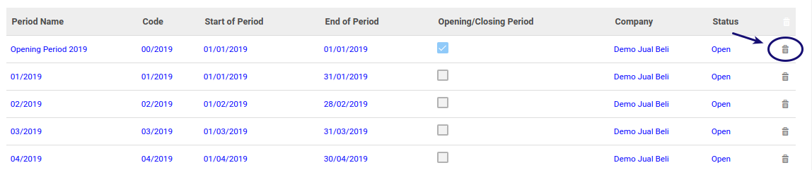

# Menghapus Fiscal Period

## A. INPUT

* Data fiscal perid yang akan dihapus harus memiliki status **Open**

## B. LANGKAH KERJA

### MELALUI MENU FISCAL PERIOD

1. Buka menu **Accounting -> Configuration -> Periods -> Period**. Abaikan jika sudah berada pada menu yang dimaksud.
2. Buka data fiscal period yang akan dihapus. Abaikan jika data sudah dibuka.
3. Klik tombol **More** pada bagian atas-kiri form.

4. Klik tombol **Delete** pada drop-down yang muncul pada tombol **More**.

5. Klik tombol **Ok** pada dialog konfirmasi penghapusan yang muncul.

### MELALUI MENU FISCAL YEAR

1. Buka menu **Accounting -> Configuration -> Periods -> Fiscal Year**. Abaikan jika sudah berada pada menu yang dimaksud.
2. Buka data fiscal years dimana data fiscal period yang akan dihapus. Abaikan jika data sudah dibuka.
3. Letakkan kursor pada data fiscal period yang akan dihapus. Abaikan jika data berada pada data yang dimaksud.
4. Tekan tombol delete yang ada di sebelah kanan fiscal period.

## C. OUTPUT

* Data fiscal period akan terhapus.

## Chapter
- [Konfigurasi](../../konfigurasi.md)
- [Fiscal Period](../fiscal-period.md)
- [Penjelasan Fiscal Period](penjelasan.md)
- [Generate Fiscal Period Per Bulan](generate-monthly.md)
- [Generate Fiscal Period per 3 Bulan](generate-3monthly.md)
- [Membuat Fiscal Period Secara Manual](membuat.md)
- [Memodifikasi Fiscal Period](memodifikasi.md)
