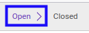
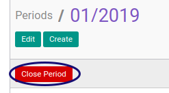
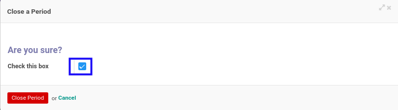

# Menutup Fiscal Period

## A. INPUT

* Data fiscal period yang akan ditutup harus memiliki status **Open**

* User yang akan menutup harus memiliki akses untuk menutup fiscal period.

## B. LANGKAH KERJA

1. Buka menu **Accounting -> Configuration -> Periods -> Period**. Abaikan jika sudah berada pada menu yang dimaksud.
2. Buka data fiscal period yang akan ditutup. Abaikan jika data sudah dibuka.
3. Klik tombol **Close Period** pada bagian atas-kiri form.

5. Aktifkan **Check this Box** pada *pop-up* **Close a Period** yang muncul.

5. Klik tombol **Close Period** pada *pop-up* **Close a Period** yang muncul.

## C. OUTPUT

* Data fiscal period akan tertutup.

## Chapter
- [Konfigurasi](../../konfigurasi.md)
- [Fiscal Period](../fiscal-period.md)
- [Penjelasan Fiscal Period](penjelasan.md)
- [Generate Fiscal Period Per Bulan](generate-monthly.md)
- [Generate Fiscal Period per 3 Bulan](generate-3monthly.md)
- [Membuat Fiscal Period Secara Manual](membuat.md)
- [Menghapus Fiscal Period](menghapus.md)
- [Membuka Fiscal Period](membuka.md)
