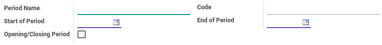

# Fiscal Year

### <a name="bagian-header">HEADER</a>

#### <a name="field-name">Fiscal Year</a>

Nama Fiscal Year

#### <a name="field-code">Code</a>

Code Fiscal Year

#### <a name="field-start-date">Start Date</a>

Tanggal dimulainya Fiscal Year

#### <a name="field-end-date">End Date</a>

Tanggal berakhirnya Fiscal Year

#### <a name="field-end-journal-period-id">End of Year Entries Journal</a>

TO DO

### <a name="bagian-detail-periode">DETAIL PERIODE</a>

#### <a name="field-detail-periode-name">Period Name</a>

Nama Periode

#### <a name="field-detail-periode-code">Code</a>

Code Periode

#### <a name="field-detail-periode-date-start">Start of Period</a>

Tanggal dimulainya periode

#### <a name="field-detail-periode-date-end">End of Period</a>

Tanggal berakhirnya periode

#### <a name="field-detail-periode-special">Opening/Closing Period</a>

Sebagai informasi apakah data periode merupakan Opening atau Closing dari Fiscal Year
