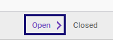
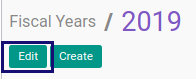

# Memodifikasi Fiscal Year

## A. INPUT

* Data fiscal year yang akan dimodifikasi harus memiliki status **Open**.

## B. LANGKAH KERJA

1. Buka menu **Accounting -> Configuration -> Periods -> Fiscal Years**. Abaikan jika sudah berada pada menu yang dimaksud.
2. Buka data fiscal years yang akan dimodifikasi. Abaikan jika data sudah dibuka.
3. Klik tombol **Edit** pada bagian atas-kiri form.

4. Ubah **[Fiscal Year](./penjelasan.md#field-name)** jika diperlukan. Harus diisi.
5. Ubah **[Code](./penjelasan.md#field-code)** jika diperlukan. Harus diisi.
6. Ubah **[Start Date](./penjelasan.md#field-start-date)** jika diperlukan. Harus diisi.
7. Ubah **[Start Date](./penjelasan.md#field-end-date)** jika diperlukan. Harus diisi.
8. Klik tombol **Save** pada bagian atas-kiri form.

## C. OUTPUT

* Data fiscal Years akan berubah sesuai dengan perubahan yang dilakukan.

## Chapter
- [Konfigurasi](../../konfigurasi.md)
- [Fiscal Year](../fiscal-year.md)
- [Penjelasan Fiscal Year](penjelasan.md)
- [Membuat Fiscal Year](membuat.md)
- [Menghapus Fiscal Year](menghapus.md)
