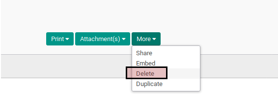

# Menghapus Fiscal Year

## A. INPUT

* Data fiscal year yang akan dihapus harus memiliki status **Open** dan tidak memiliki detail periods.

## B. LANGKAH KERJA

1. Buka menu **Accounting -> Configuration -> Periods -> Fiscal Years**. Abaikan jika sudah berada pada menu yang dimaksud.
2. Buka data fiscal years yang akan dihapus. Abaikan jika data sudah dibuka.
3. Klik tombol **More** pada bagian atas-kiri form.

4. Klik tombol **Delete** pada drop-down yang muncul pada tombol **More**.

5. Klik tombol **Ok** pada dialog konfirmasi penghapusan yang muncul.

## C. OUTPUT

* Data fiscal years akan terhapus.

## Chapter
- [Konfigurasi](../../konfigurasi.md)
- [Fiscal Year](../fiscal-year.md)
- [Penjelasan Fiscal Year](penjelasan.md)
- [Membuat Fiscal Year](membuat.md)
- [Memodifikasi Fiscal Year](memodifikasi.md)
