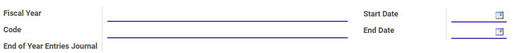
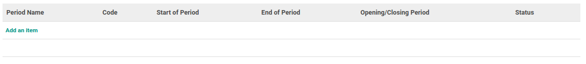
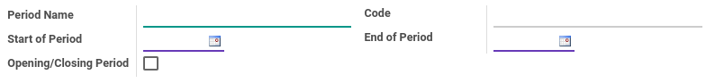

# Penjelasan Fiscal Year

Informasi pada Fiscal Year dibagi menjadi beberapa area, diantaranya:

* [Header](#bagian-header)
* [Detail Period](#bagian-detail-period)

### <a name="bagian-header">HEADER</a>

#### <a name="field-name">Fiscal Year</a>

Nama Fiscal Year

#### <a name="field-code">Code</a>

Code Fiscal Year

#### <a name="field-start-date">Start Date</a>

Tanggal dimulainya Fiscal Year

#### <a name="field-end-date">End Date</a>

Tanggal berakhirnya Fiscal Year

#### <a name="field-end-journal-period-id">End of Year Entries Journal</a>

Jurnal Entry Akhir Period, merupakan dari proses generate opening entry

### <a name="bagian-detail-periode">DETAIL PERIODE</a>

#### <a name="field-detail-periode-name">Period Name</a>

Nama Periode

#### <a name="field-detail-periode-code">Code</a>

Code Periode

#### <a name="field-detail-periode-date-start">Start of Period</a>

Tanggal dimulainya periode

#### <a name="field-detail-periode-date-end">End of Period</a>

Tanggal berakhirnya periode

#### <a name="field-detail-periode-special">Opening/Closing Period</a>

Sebagai informasi apakah data periode merupakan Opening atau Closing dari Fiscal Year

## Chapter
- [Konfigurasi](../../konfigurasi.md)
- [Fiscal Year](../fiscal-year.md)
- [Membuat Fiscal Year](membuat.md)
- [Memodifikasi Fiscal Year](memodifikasi.md)
- [Menghapus Fiscal Year](menghapus.md)
