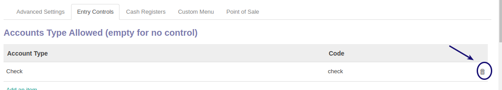

# Menghapus Account Type

*(Instruksi kerja ini merupakan sub instruksi dari (1) [Membuat Journal](./membuat.md), atau (2) [Memodifikasi Journal](./memodifikasi.md). Instruksi kerja ini tidak bisa berdiri sendiri)*

## A. INPUT

*(Tidak ada instruksi khusus)*

## B. LANGKAH KERJA

1. Klik icon tempat sampah pada bagian kanan data **Voucher Line** yang akan dihapus.

2. Lanjutkan [langkah ke-20 Instruksi Kerja Membuat Journal](./membuat.md#l20) atau [langkah ke-20 Instruksi Kerja Memodifikasi Journal](./memodifikasi.md#l20).

## C. OUTPUT

*(Data account type akan terhapus)*

## Chapter
- [Konfigurasi](../../konfigurasi.md)
- [Journal](../journal.md)
- [Penjelasan Journal](penjelasan.md)
- [Membuat Journal](membuat.md)
- [Memodifikasi Journal](memodifikasi.md)
- [Menghapus Journal](menghapus.md)
- [Membuat Account Type](membuat-account-type.md)
