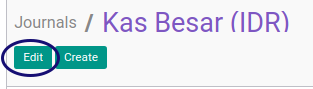

# Memodifikasi Journal

## A. INPUT

*(Tidak ada instruksi khusus)*

## B. LANGKAH KERJA

1. Buka menu **Accounting -> Configuration -> Journals -> Journal**. Abaikan jika sudah berada pada menu yang dimaksud.
2. Buka data Jurnal yang akan dimodifikasi. Abaikan jika data sudah dibuka.
3. Klik tombol **Edit** pada bagian atas-kiri form.

4. Ubah **[Journal Name](./penjelasan.md#field-name)** jika diperlukan. Harus diisi.
5. Ubah **[Code](./penjelasan.md#field-code)** jika diperlukan. Harus diisi.
6. Pilih **[Type](./penjelasan.md#field-type)** jika diperlukan. Harus diisi.
7. Pilih **[Analytic Journal](./penjelasan.md#field-analytic-jounal-id)** jika diperlukan. Tidak harus diisi.
8. Pilih **[Subtype](./penjelasan.md#field-subtype)** jika diperlukan. Tidak harus diisi.
9. Pilih **[Default Debit Account](./penjelasan.md#field-default-debit-acc-id)** jika diperlukan. Tidak harus diisi.
10. Pilih **[Default Credit Account](./penjelasan.md#field-default-credit-acc-id)** jika diperlukan. Tidak harus diisi.
11. Pilih **[Currency](./penjelasan.md#field-default-currency-id)** jika diperlukan. Tidak harus diisi.
12. Klik **[Tab Setting Advance](./penjelasan.md#tab-advanced-setting)**
13. Pilih **[User](./penjelasan.md#field-user-id)**. Secara default adalah user yang sedang login.
14. Pilih **[Entry Sequence](./penjelasan.md#field-sequence-id)** jika diperlukan. Tidak harus diisi.
15. Centang **[Centralized Counterpart](./penjelasan.md#field-centralization)** jika diperlukan.
16. Centang **[Autopost Created Moves](./penjelasan.md#field-entry-posted)** jika diperlukan.
17. Centang **[Allow Cancelling Entries](./penjelasan.md#field-update-posted)** jika diperlukan.
18. Centang **[Check Date in Period](./penjelasan.md#field-allow-date)** jika diperlukan.
19. Centang **[Group Invoice Lines](./penjelasan.md#field-group-invoice-lines)** jika diperlukan.
20. Klik **[Tab Entry Control](./penjelasan.md#tab-entry-controls)** untuk mengisi akun yang diperbolehkan.
21. <a name="l21">[Membuat](./membuat-account-type.md)/[Hapus](./hapus-account-type.md) **Accout Type**</a>. Ulangi langkah ini sampai **Account Type** yang diperbolehkan sesuai dengan keinginan.
22. Klik **[Tab Cash Register](./penjelasan.md#tab-cash-registers)**.
23. Pilih **[Profit Account](./penjelasan.md#field-profit-account-ids)** jika diperlukan. Tidak harus diisi.
24. Pilih **[Loss Account](./penjelasan.md#field-loss-account-ids)** jika diperlukan. Tidak harus diisi.
25. Pilih **[Internal Transfer Account](./penjelasan.md#field-internal-account-ids)** jika diperlukan. Tidak harus diisi.
26. Klik **[Tab Point of Sales](./penjelasan.md#tab-point-of-sale)**.
27. Centang **[PoS Payment Method](./penjelasan.md#field-pos-payment-method)** jika diperlukan.
28. Ubah **[Display Name On POS](./penjelasan.md#field-pos-journal-display-name)** jika diperlukan. Tidak harus diisi.
29. Centang **[Self Checkout Payment Method](./penjelasan.md#field-pos-payment-method)** jika diperlukan.
30. Ubah **[Amount Authorized Difference](./penjelasan.md#field-amount-authorized-diff)** jika diperlukan. Tidak harus diisi.
31. Pilih **[Payment Bank](./penjelasan.md#field-payment-bank-ids)** jika diperlukan. Tidak harus diisi.
32. Klik tombol **Save** pada bagian atas-kiri form.

## C. OUTPUT

* Data *Journal* akan tersimpan sesuai dengan perubahan.

## Chapter
- [Konfigurasi](../../konfigurasi.md)
- [Journal](../journal.md)
- [Penjelasan Journal](penjelasan.md)
- [Membuat Journal](membuat.md)
- [Menghapus Journal](menghapus.md)
- [Membuat Account Type](membuat-account-type.md)
- [Menghapus Account Type](hapus-account-type.md)
