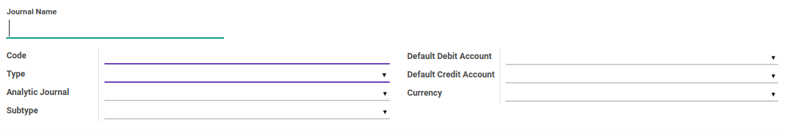
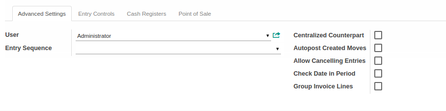
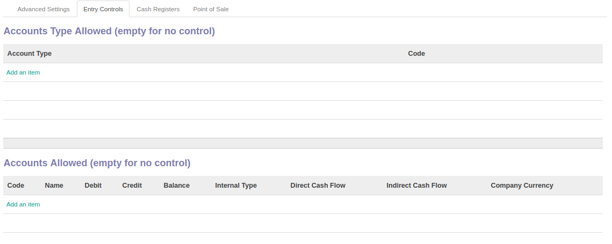
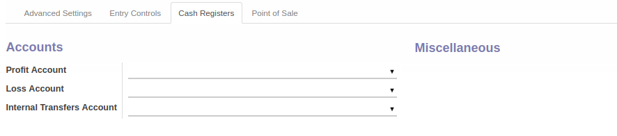
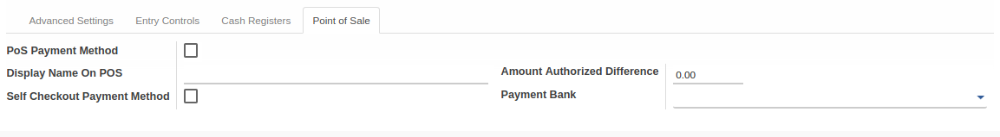

# Penjelasan Journal

Informasi pada Journal dibagi menjadi beberapa area, diantaranya:

* [Header](#bagian-header)
* [Tab Advanced Settings](#tab-advanced-setting)
* [Tab Entry Controls](#tab-entry-controls)
* [Tab Cash Registers](#tab-cash-registers)
* [Tab Point Of Sale](#tab-point-of-sale)

### <a name="bagian-header">HEADER</a>

#### <a name="field-name">Journal Name</a>

Nama Jurnal

#### <a name="field-code">Code</a>

Kode Jurnal

#### <a name="field-type">Type</a>

Tipe Jurnal. Terbagi atas beberapa tipe, yaitu: 
* Sale
* Sale Refund
* Purchase
* Purchase Refund
* Cash
* Bank and Checks
* General
* Opening/Closing Situation

#### <a name="field-analytic-journal-id">Analytic Journal</a>

Analitik Jurnal

#### <a name="field-subtype">Subtype</a>

Sub-Tipe Jurnal

#### <a name="field-default-debit-acc-id">Default Debit Account</a>

Sebagai nilai default debit akun apabila journal terpilih

#### <a name="field-default-credit-acc-id">Default Credit Account</a>

Sebagai nilai default kredit akun apabila journal terpilih

#### <a name="field-currency-id">Currency</a>

Mata Uang pada jurnal

### <a name="tab-advanced-setting">TAB ADVANCED SETTINGS</a>

#### <a name="field-user-id">User</a>

User Pengguna

#### <a name="field-sequence-id">Entry Sequence</a>

Mengatur sequence untuk jurnal pada saat pembuatan jurnal entries

#### <a name="field-centralization">Centralized Counterpart</a>

Menentukan apakah masing-masing jurnal tidak akan membuat counterpart baru.
Digunakan pada saat pentupuan tahun fiscal.

#### <a name="field-entry-posted">Autopost Created Moves</a>

Mementukan apakah jurnal akan terposting secara otomatis

#### <a name="field-update-posted">Allow Cancelling Entries</a>

Mengizinkan untuk melakukan pembatalan pada jurnal entries

#### <a name="field-allow-date">Check Date in Period</a>

Menentukan apakah akan dilakukan pengecekan periode tanggal transaksi

#### <a name="field-group-invoice-lines">Group Invoice Lines</a>

Menentukan apakah saat mengenerate invoice, isian pada baris invoice akan dikelompokkan berdasarakan akun

### <a name="tab-entry-controls">TAB ENTRY CONTROLS</a>

#### <a name="field-type-control-ids">Accounts Type Allowed</a>

Tipe Akun yang diperbolehkan

#### <a name="field-account-control-ids">Accounts Allowed</a>

Akun yang diperbolehkan

### <a name="tab-cash-registers">TAB CASH REGISTERS</a>

#### <a name="field-profit-account-ids">Profit Account</a>

Akun keuntungan/laba

#### <a name="field-loss-account-ids">Loss Account</a>

Akun kehilangan/rugi

#### <a name="field-internal-account-ids">Internal Transfers Account</a>

Akun internal transfer

### <a name="tab-point-of-sale">TAB POINT OF SALE</a>

#### <a name="field-pos-payment-method">PoS Payment Method</a>

Menentukan apakah jurnal ini digunakan sebagai metode pembayaran pada transaksi Point Of Sales

#### <a name="field-pos-journal-display-name">Display Name On POS</a>

Nama yang muncul pada Point if Sales

#### <a name="field-self-checkout-payment-method">Self Checkout Payment Method</a>

Menentukan apakah metode pembayaran akan dilakukan secara otomatis atau manual

#### <a name="field-amount-authorized-diff">Amount Authorized Difference</a>

Nilai selisih yang diperbolehkan saat closing

#### <a name="field-payment-bank-ids">Payment Bank</a>

Bank Payment

## Chapter
- [Konfigurasi](../../konfigurasi.md)
- [Journal](../journal.md)
- [Membuat Journal](membuat.md)
- [Memodifikasi Journal](memodifikasi.md)
- [Menghapus Journal](menghapus.md)
- [Membuat Account Type](membuat-account-type.md)
- [Menghapus Account Type](hapus-account-type.md)
