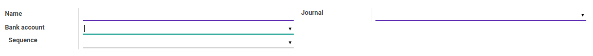

# Penjelasan Payment Mode

### <a name="bagian-header">HEADER</a>

#### <a name="field-name">Name</a>

Nama dari Payment Mode

#### <a name="field-journal-id">Journal</a>

Mendefinisikan Jurnal Bank / Cash yang akan dipakai dalam Payment Mode

#### <a name="field-bank-id">Bank Account</a>

Mendefinisikan Bank yang akan dipakai dalam Payment Mode

#### <a name="field-bank-id">Sequence</a>

Mendefinisikan Kode Sequence yang akan dipakai dalam Payment Mode
