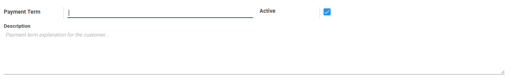
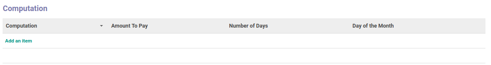
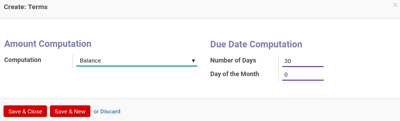
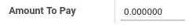

# Payment Term

### <a name="bagian-header">HEADER</a>

#### <a name="field-name">Payment Term</a>

Nama dari Payment Term

#### <a name="field-active">Active</a>

Sebagai penanda apakah data adalah aktif/non-aktif

#### <a name="field-description">Description</a>

Deskripsi dari Payment Term

### <a name="detail-computation">COMPUTATION</a>

#### <a name="detail-computation-field-value">Computation</a>

Jenis-jenis perhitungan yang bisa dipakai dalam komputasi. Komputasi dibagi atas 3, yaitu: 
* Percent - Menggunakan persentase dalam perhitungan payment term. Skala persentase adalah 0 - 1
* Balance
* Fixed Amount - Menggunakan nilai fix dalam perhitungan payment term

>(**Note:** Untuk komputasi dengan jenis **(1)Percent*; **(2)Fixed Amount*, apabila dipilih maka akan muncul input box)

#### <a name="detail-computation-field-days">Number of Days</a>

Mendefinisikan hari yang akan dipakai dalam perhitungan payment term

#### <a name="detail-computation-field-days2">Day of the Month</a>

Mendefinisikan bulan yang akan dipakai dalam perhitungan payment term.
Apabila diisi: 
* -1: Perhitungan payment term akan menggunakan hari terakhir pada bulan depan
* 0: Perhitungan akan langsung menggunakan Number of Days pada bulan yang sedang berjalan
* 0++: Perhitungan akan langsung menggunakan Nilai yang diberikan pada bulan depan