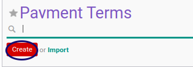

# Membuat Payment Term

## A. INPUT

*(Tidak ada instruksi khusus)*

## B. LANGKAH KERJA

1. Buka menu **Accounting -> Configuration -> Miscellaneous -> Payment Term**
2. Klik tombol **Create** pada bagian atas-kiri form.

3. Isi **[Payment Term](./penjelasan.md#field-name)**. Harus diisi.
4. Centang **[Active](./penjelasan.md#field-active)** jika statusnya aktif.
5. Isi **[Description](./penjelasan.md#field-description)**. Tidak Harus diisi.
6. Klik Tabel **[Computation](./penjelasan.md#detail-computation)**.
7. <a name="l7">[Membuat](./membuat-computation.md)/[Memodifikasi](./memodifikasi-computation.md)/[Menghapus](./menghapus-computation.md) **Computation**</a>. Ulangi langkah ini sampai **Computation** yang diperlukan sesuai dengan keperluan.
8. Klik tombol **Save** pada bagian atas-kiri form.

## C. OUTPUT

* Data *Payment Term* akan tersimpan

## Chapter

- [Konfigurasi](../../konfigurasi.md)
- [Payment Term](../payment-term.md)
- [Penjelasan Payment Term](penjelasan.md)
- [Memodifikasi Payment Term](memodifikasi.md)
- [Menghapus Payment Term](menghapus.md)
- [Membuat Computation](membuat-computation.md)
- [Memodifikasi Computation](memodifikasi-computation.md)
- [Menghapus Computation](menghapus-computation.md)
