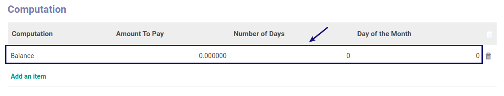

# Memodifikasi Computation

*(Instruksi kerja ini merupakan sub instruksi dari (1) [Membuat Payment Term](./membuat.md), atau (2) [Memodifikasi Payment Term](./memodifikasi.md). Instruksi kerja ini tidak bisa berdiri sendiri)*

## A. INPUT

*(Tidak ada instruksi khusus)*

## B. LANGKAH KERJA

1. Double Klik pada data **computation** yang akan dimodifikasi pada tab **Computation**

2. Ubah **[Computation](./penjelasan.md#detail-computation-field-value)** jika diperlukan. Harus diisi.
3. Ubah **[Amount To Pay](./penjelasan.md#detail-computation-field-amount-to-pay)** jika diperlukan. Harus diisi.
4. Ubah **[Number of Days](./penjelasan.md#detail-computation-field-days)** jika diperlukan. Harus diisi.
5. Ubah **[Day of the Month](./penjelasan.md#detail-computation-field-days2)** jika diperlukan. Harus diisi.
6. Klik tombol **Save** pada bagian kiri bawah.

7. Lanjutkan [langkah ke-7 Instruksi Kerja Membuat Payment Term](./membuat.md#l7)/[langkah ke-8 Instruksi Kerja Memodifikasi Payment Term](./memodifikasi.md#l8).

## C. OUTPUT

*(Tidak ada instruksi khusus)*

## Chapter

- [Konfigurasi](../../konfigurasi.md)
- [Payment Term](../payment-term.md)
- [Penjelasan Payment Term](penjelasan.md)
- [Membuat Payment Term](membuat.md)
- [Memodifikasi Payment Term](memodifikasi.md)
- [Menghapus Payment Term](menghapus.md)
- [Membuat Computation](membuat-computation.md)
- [Menghapus Computation](menghapus-computation.md)
