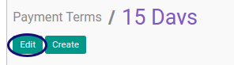

# Memodifikasi Payment Term

## A. INPUT

*(Tidak ada instruksi khusus)*

## B. LANGKAH KERJA

1. Buka menu **Accounting -> Configuration -> Miscellaneous -> Payment Term**. Abaikan jika sudah berada pada menu yang dimaksud.
2. Buka data Payment Term yang akan dimodifikasi. Abaikan jika data sudah dibuka.
3. Klik tombol **Edit** pada bagian atas-kiri form.

4. Ubah **[Payment Term](./penjelasan.md#field-name)** jika diperlukan. Harus diisi.
5. Ubah **[Active](./penjelasan.md#field-active)** jika diperlukan.
6. Ubah **[Description](./penjelasan.md#field-description)** jika diperlukan. Tidak Harus diisi.
7. Klik Tabel **[Computation](./penjelasan.md#detail-computation)**.
8. <a name="l8">[Membuat](./membuat-computation.md)/[Memodifikasi](./memodifikasi-computation.md)/[Menghapus](./menghapus-computation.md) **Computation**</a>. Ulangi langkah ini sampai **Computation** yang diperlukan sesuai dengan keperluan.
9. Klik tombol **Save** pada bagian atas-kiri form.

## C. OUTPUT

* Data perubahan *Payment Term* akan tersimpan

## Chapter

- [Konfigurasi](../../konfigurasi.md)
- [Payment Term](../payment-term.md)
- [Penjelasan Payment Term](penjelasan.md)
- [Membuat Payment Term](membuat.md)
- [Menghapus Payment Term](menghapus.md)
- [Membuat Computation](membuat-computation.md)
- [Memodifikasi Computation](memodifikasi-computation.md)
- [Menghapus Computation](menghapus-computation.md)
