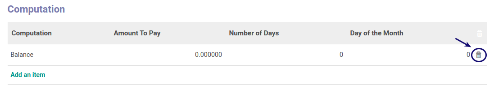

# Menghapus Computation

*(Instruksi kerja ini merupakan sub instruksi dari (1) [Membuat Payment Term](./membuat.md), atau (2) [Memodifikasi Payment Term](./memodifikasi.md). Instruksi kerja ini tidak bisa berdiri sendiri)*

## A. INPUT

*(Tidak ada instruksi khusus)*

## B. LANGKAH KERJA

1. Klik gambar **tong sampah** di sebelah kanan pada data **computation** yang akan dihapus pada tab **Computation**

2. Lanjutkan [langkah ke-7 Instruksi Kerja Membuat Payment Term](./membuat.md#l7)/[langkah ke-8 Instruksi Kerja Memodifikasi Payment Term](./memodifikasi.md#l8).

## C. OUTPUT

*(Tidak ada instruksi khusus)*

## Chapter

- [Konfigurasi](../../konfigurasi.md)
- [Payment Term](../payment-term.md)
- [Penjelasan Payment Term](penjelasan.md)
- [Membuat Payment Term](membuat.md)
- [Memodifikasi Payment Term](memodifikasi.md)
- [Menghapus Payment Term](menghapus.md)
- [Membuat Computation](membuat-computation.md)
- [Memodifikasi Computation](memodifikasi-computation.md)
