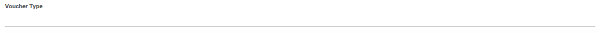
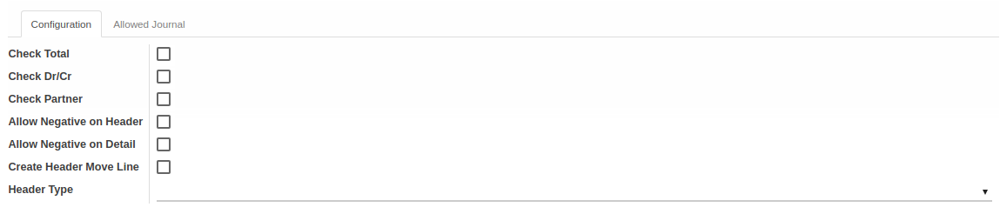
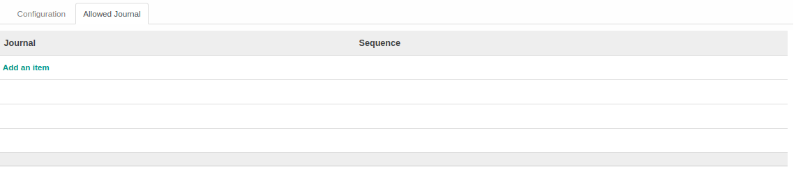
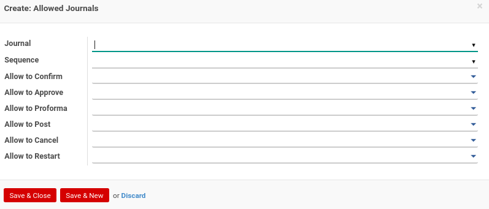

# Voucher Type

Informasi pada Journal dibagi menjadi beberapa area, diantaranya:

* [Header](#bagian-header)
* [Tab Configuration](#tab-configuration)
* [Tab Allowed Journal](#tab-allowed-journal)

### <a name="bagian-header">HEADER</a>

#### <a name="field-name">Voucher Type</a>

Nama Tipe Voucher

### <a name="tab-configuration">TAB CONFIGURATION</a>

#### <a name="field-check-total">Check Total</a>

ToDo

#### <a name="field-check-debit-credit">Check Dr/Cr</a>

ToDo

#### <a name="field-check-partner">Check Partner</a>

ToDo

#### <a name="field-header-allowed-negative">Allow Negative on Header</a>

ToDo

#### <a name="field-detail-allowed-negative">Allow Negative on Detail</a>

ToDo

#### <a name="field-create-header-item">Create Header Move Line</a>

ToDo

#### <a name="field-header-type">Header Type</a>

Tipe Header. Terbagi atas beberapa 2 tipe, yaitu: 
* Debit
* Credit

### <a name="tab-allowed-journal">TAB ALLOWED JOURNAL</a>

#### <a name="field-journal-id">Journal</a>

Mendefinisikan Jurnal yang diperbolehkan pada Tipe Voucher

#### <a name="field-sequence-id">Sequence</a>

Mendefinisikan kode sequence yang akan digunakan

#### <a name="field-allow-confirm-group-ids">Allow to Confirm</a>

Mendefinisikan group yang diijinkan untuk melakukan Confirm

#### <a name="field-allow-approve-group-ids">Allow to Approve</a>

Mendefinisikan group yang diijinkan untuk melakukan Approve

#### <a name="field-allow-proforma-group-ids">Allow to Proforma</a>

Mendefinisikan group yang diijinkan untuk melakukan Proforma

#### <a name="field-allow-post-group-ids">Allow to Post</a>

Mendefinisikan group yang diijinkan untuk melakukan Post

#### <a name="field-allow-cancel-group-ids">Allow to Cancel</a>

Mendefinisikan group yang diijinkan untuk melakukan Cancel

#### <a name="field-allow-restart-group-ids">Allow to Restart</a>

Mendefinisikan group yang diijinkan untuk melakukan Restart 