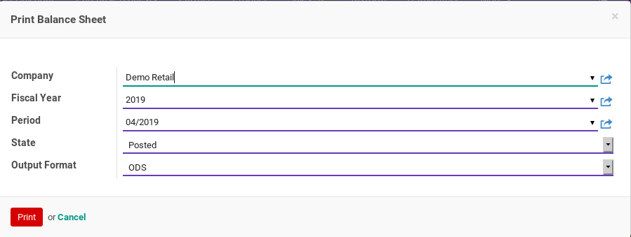
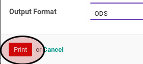

# Balance Sheet

## A. INPUT

## B. LANGKAH KERJA

1. Buka menu **Accounting -> Reporting -> Balance Sheet**. Pop-up **Report Balance Sheet** akan muncul

2. Pilih **Company**. Perusahaan yang akan dicetak laporan balance sheetnya.
3. Pilih **Fiscal Year**. Tahun pembukuan laporan.
4. Pilih **Period**. Periode laporan.
5. Pilih **State**. Pilih **All** agar balance sheet dibuat dari keseluruhan penjurnalan (journal entry). Pilih **Posted** agar balance sheet dibuat dari penjurnalan yang sudah diposting. Pilih **Unposted** agar balance sheet dibuat dari penjurnalan yang belum diposting.
6. Pilih **Output Format**. Pilih **ODS** untuk mencetak balance sheet dalam format Open-Office Spreadsheet. Pilih **XLS** untuk mencetak balance sheet dalam format Microsoft Excell. Pilih **PDF** untuk mencetak balance sheet dalam format Portable Document Format.
7. Klik tombol **Print** pada bagian bawah-kiri pop-up **Report Balance Sheet**.

## C. OUTPUT
