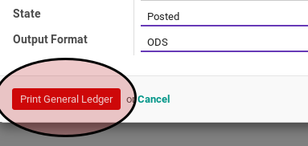

# General Ledger

## A. INPUT

## B. LANGKAH KERJA

1. Buka menu **Accounting -> Reporting -> General Ledger**. Pop-up **Report General Ledger** akan muncul

2. Pilih **Company**. Perusahaan yang akan dicetak laporan general ledgernya.
3. Pilih **Fiscal Year**. Tahun pembukuan laporan.
4. Pilih **Start Period**. Periode mulai laporan.
5. Pilih **End Period**. Periode akhir laporan.
6. Pilih **Accounts**. Akun-akun yang akan dicetak general ledgernya.
7. Pilih **State**. Pilih **All** agar general ledger dibuat dari keseluruhan penjurnalan (journal entry). Pilih **Posted** agar general ledger dibuat dari penjurnalan yang sudah diposting. Pilih **Unposted** agar general ledger dibuat dari penjurnalan yang belum diposting.
8. Pilih **Output Format**. Pilih **ODS** untuk mencetak general ledger dalam format Open-Office Spreadsheet. Pilih **XLS** untuk mencetak general ledger dalam format Microsoft Excell. Pilih **PDF** untuk mencetak general ledger dalam format Portable Document Format.
9. Klik tombol **Print General Ledger** pada bagian bawah-kiri pop-up **Report General Ledger**.

## C. OUTPUT
