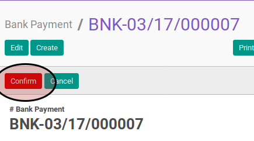

# Mengkonfirmasi Bank Payment

## A. INPUT

* Data bank payment yang akan dikonfirmasi harus memiliki status **Draft**.

* User yang akan mengkonfirmasi harus memiliki akses untuk mengkonfirmasi bank payment.

## B. LANGKAH KERJA

1. Buka menu **Accounting -> Bank & Cash -> Bank Payment**. Abaikan jika sudah berada
pada menu yang dimaksud.
2. Buka data bank payment yang akan dikonfirmasi. Abaikan jika data sudah dibuka.
3. Klik tombol **Confirm** pada bagian atas-kiri form.

## C. OUTPUT

* Status dari bank payment akan berubah menjadi **Waiting for Approval**

* Isian bank payment sudah tidak bisa diubah
