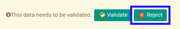

# Menolak Bank Payment

## A. INPUT

* Bank payment yang dapat ditolak harus memiliki status **Waiting for Approval**.

* User yang akan menolak harus memiliki akses untuk menolak bank payment.

## B. LANGKAH KERJA

1. Buka menu **Accounting -> Bank & Cash -> Bank Payment**. Abaikan jika sudah berada pada menu yang dimaksud.
2. Buka data bank payment yang akan ditolak. Abaikan jika data sudah dibuka.
3. Klik tombol **Reject** pada bagian atas-kiri form.

## C. OUTPUT

* Data bank payment telah ditolak.

