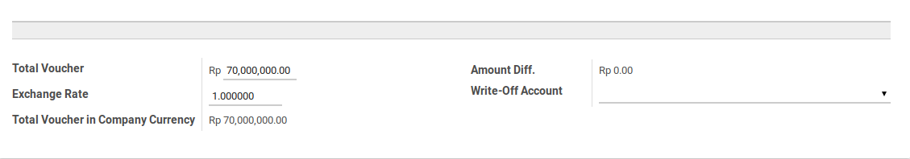

# Penjelasan

Informasi pada Bank Payment dibagi menjadi beberapa area, diantaranya:

* [Header](#bagian-header)
* [Voucher Item](#bagian-detail)
* [Footer](#bagian-footer)
* [Tab Notes](#tab-notes)
* [Tab Accounting Information](#tab-accounting-information)
* [Tab Log](#tab-log)
* [Tab Policy](#tab-policy)

### <a name="bagian-header">HEADER</a>

#### <a name="field-name"># Bank Payment</a>

Nomor dokumen bank payment

#### <a name="field-company">Company</a>

Perusahaan pemilik dokumen bank payment

#### <a name="field-ou">Default Operating Unit</a>

Operating unit pemilik dokumen. Secara default terisi sesuai dengan operating unit pada Journal.

#### <a name="field-date">Date</a>

Tanggal transaksi

#### <a name="field-period">Period</a>

Periode akuntansi terjadinya transaksi

#### <a name="field-journal">Journal</a>

Buku jurnal yang akan digunakan untuk mencatat penjurnalan bank payment.

#### <a name="field-payment-mode">Payment Mode</a>

Metode pengeluaran. Contoh: Pemindahbukuan, EDC, dll.

#### <a name="field-partner">Partner</a>

Pihak penerima. Field ini akan menentukan *partner* yang digunakan pada penjurnalan
bank payment. *Partner* yang digunakan pada penjurnalan bank payment adalah *commercial partner*
dari isian **Partner**. Diisi apabila penerimaan terkait hanya dengan 1 pihak penerima. Jangan diisi
apabila penerimaan terkait dengan lebih dari 1 pihak penerima.

#### <a name="field-description">Description</a>

Keterangan utama transaksi. Isi field ini akan digunakan sebagai deskripsi penjurnalan bank payment di
sisi kredit. Akan muncul di *general ledger*

### <a name="bagian-footer">FOOTER</a>

#### <a name="field-total-voucher">Total Voucher</a>

Total pengeluaran dalam mata uang yang sesuai dengan buku jurnal

#### <a name="field-exchange-rate">Exchange Rate</a>

Spot rate kurs

#### <a name="field-total-voucher-company-currency">Total Voucher In Company Currency</a>

Total pengeluaran dalam mata uang perusahaan. Nilai ini akan didebit pada penjurnalan
bank payment.

### <a name="bagian-detail">DETAIL</a>

#### <a name="field-detail-partner">Partner</a>

Pihak penerima. Apabila bank payment terkait hanya dengan satu pihak penerima, maka isian
ini harus sama dengan isian **Partner** pada bagian header.

#### <a name="field-detail-move-line">Move Line</a>

Journal item yang akan direkonsiliasi

#### <a name="field-detail-account">Account</a>

Akun yang akan didebit pada penjurnalan bank payment

#### <a name="field-detail-aa">Analytic Account</a>

Kode biaya

#### <a name="field-detail-amount">Amount</a>

Jumlah detail pengeluaran.

#### <a name="field-detail-amount-move-date">Amount In Company Currency At Move Date</a>

Jumlah detail pengeluaran sesuai dengan mata uang perusahaan dengan kurs tanggal **Move Line**

#### <a name="field-detail-amount-voucher-date">Amount In Company Currency At Voucher Date</a>

Jumlah detail pengeluaran sesuai dengan mata uang perusahaan dengan kurs sesuai dengan spot rate. Nilai ini akan didebit pada penjurnalan bank payment jika bernilai positif. Nilai ini akan dikredit jika bernilai negatif.

#### <a name="field-detail-diff">Diff Amount In Company Currency</a>

Selisih antara **Amount In Company Currency At Move Date** dan **Amount In Company Currency At Voucher Date**. Nilai ini akan dijurnal sebagai selisih kurs jika > 0.0

#### <a name="field-detail-description">Description</a>

Keterangan **Voucher Detail**.

### <a name="tab-notes">TAB NOTES</a>

#### <a name="field-note">Note</a>

Catatan tambahan

### <a name="tab-accounting-information">TAB ACCOUNTING INFORMATION</a>

#### <a name="field-accounting-entry">Accounting Entry</a>

Penjurnalan (journal entry) yang dihasilkan ketika bank payment diposting

### <a name="tab-log">TAB LOG</a>

### <a name="tab-log">TAB POLICY</a>

