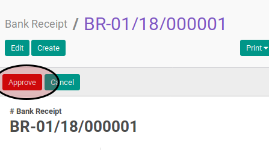

# Menyetujui Bank Receipt

1. Buka menu **Accounting -> Bank & Cash -> Bank Receipt**. Abaikan jika sudah berada
pada menu yang dimaksud.
2. Buka data bank receipt yang akan disetujui. Abaikan jika data sudah dibuka.
3. Klik tombol **Approve** pada bagian atas-kanan form.

