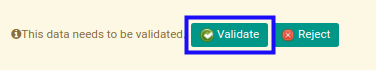

# Menyetujui Bank Receipt

## A. INPUT

* Data bank receipt yang akan disetujui harus memiliki status **Waiting for Approval**.

* User yang akan menyetujui harus memiliki akses untuk menyetujui bank receipt.

## B. LANGKAH KERJA

1. Buka menu **Accounting -> Bank & Cash -> Bank Receipt**. Abaikan jika sudah berada pada menu yang dimaksud.
2. Buka data bank receipt yang akan disetujui. Abaikan jika data sudah dibuka.
3. Klik tombol **Validate** pada bagian atas-kiri form.

## C. OUTPUT

* Status dari bank receipt akan berubah menjadi **Ready to Process**.

