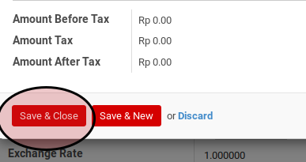

# Menambahkan Voucher Line Pada Bank Receipt

*(Instruksi kerja ini merupakan sub instruksi dari (1) [Membuat Bank Receipt](./membuat.md), atau (2) [Memodifikasi Bank Receipt](./memodifikasi.md). Instruksi kerja ini tidak bisa berdiri sendiri)*

## A. INPUT

*(Tidak ada instruksi khusus)*

## B. LANGKAH KERJA

1. Klik label **Add an Item** pada tab **Voucher Detail**

2. Pilih **[Partner](./penjelasan.md#field-detail-partner)**. Tidak harus diisi.
3. Biarkan **[Move Line](./penjelasan.md#field-move-line)** kosong.
4. Pilih **[Account](./penjelasan.md#field-detail-account)**. Harus diisi.
5. Pilih **[Analytic Account](./penjelasan.md#field-detail-aa)**. Tidak harus diisi.
6. Isi **[Amount](./penjelasan.md#field-detail-amount)**. Harus diisi.
7. Isi **[Description](./penjelasan.md#field-detail-decsription)**. Harus diisi.
8. Apabila ada pajak yang muncul terkait dengan voucher item, maka lakukan langkah
penginputan voucher item tax.
9. Klik tombol **Save & Close** untuk menyimpan dan menyudahi penginputan voucher item, atau
klik tombol **Save & New** untuk meenyimpan dan menginput voucher item baru.

Tombol **Save & Close**

Tombol **Save & New**

10. Apabila pada langkah 9 **Save & New** yang dipilih maka ulangi langkah ke-2
11. Lanjutkan [langkah ke-12 Instruksi Kerja Membuat Bank Receipt](./membuat.md#l12) atau [langkah ke-13 Instruksi Kerja Memodifikasi Bank Receipt](./memodifikasi.md#l13).

## C. OUTPUT

*(Tidak ada instruksi khusus)*
