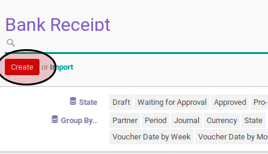

# Membuat Bank Receipt

1. Buka menu **Accounting -> Bank & Cash -> Bank Receipt**
2. Klik tombol **Create** pada bagian atas-kiri form.

3. Ubah **# Bank Receipt** dengan penomeran yang dikehendaki. Biarkan berisi **/**
apabila menghendaki penomeran otomatis.
4. Ubah **Company** jika dibutuhkan. Hanya terlihat pada implementasi multi-company. Harus diisi.
5. Isi **Date**. Harus diisi.
6. Biarkan isian **Period**.
7. Pilih **Journal**. Harus diisi.
8. Pilih **Payment Mode**. Tidak harus diisi.
9. Pilih **Partner** Tidak harus diisi.
10. Isi **Total Voucher**. Harus diisi.
11. Isi **Exchange Rate**. Harus diisi.
12. Untuk setiap detail voucher, lakukan [prosedur input detail voucher](./membuat-detail.md).
13. <a name="langkah-13">Isi</a> **Write-Off Account** apabila nilai **Amount Diff** tidak sama dengan 0.0 dan nominal tersebut ingin di-*write-off* ke akun tertentu.
14. Klik tombol **Save** pada bagian atas-kiri form.

