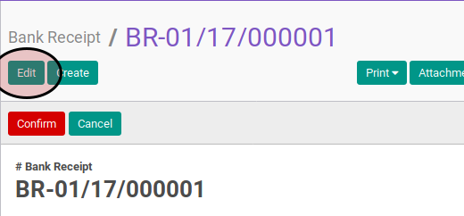
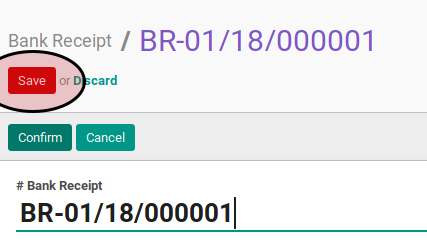

# Memodifikasi Bank Receipt

## A. INPUT

* Data bank receipt yang akan dimodifikasi harus memiliki status **Draft**.

## B. LANGKAH KERJA

1. Buka menu **Accounting -> Bank & Cash -> Bank Receipt**. Abaikan jika sudah berada pada menu yang dimaksud.
2. Buka data bank receipt yang akan dimodifikasi. Abaikan jika data sudah dibuka.
3. Klik tombol **Edit** pada bagian atas-kiri form.

4. Ubah **[# Bank Receipt](./penjelasan.md#field-name)** dengan penomeran yang dikehendaki. Biarkan berisi **/** apabila menghendaki penomeran otomatis.
5. Pilih dan sesuaikan **[Company](./penjelasan.md#field-company)** jika dibutuhkan. Hanya terlihat pada implementasi multi-company. Harus diisi.
6. Isi dan sesuaikan **[Date](./penjelasan.md#field-date)** jika dibutuhkan. Harus diisi.
7. Biarkan isian **[Period](./penjelasan.md#field-period)**.
8. Pilih dan sesuaikan **[Journal](./penjelasan.md#field-journal)** jika dibutuhkan. Harus diisi.
9. Pilih dan sesuaikan **[Payment Mode](./penjelasan.md#field-payment-mode)** jika dibutuhkan. Tidak harus diisi.
10. Pilih dan sesuaikan **[Partner](./penjelasan.md#field-partner)** jika dibutuhkan. Tidak harus diisi.
11. Isi dan sesuaikan **[Total Voucher](./penjelasan.md#field-total-voucher)** jika dibutuhkan. Harus diisi.
12. Isi dan sesuaikan **[Exchange Rate](./penjelasan.md#field-exchange-rate)** jika dibutuhkan. Harus diisi.
13. <a name="l13">[Import](./membuat-detail-import.md)/[Tambah](./membuat-detaail-manual.md)/[Modifikasi](./line-modifikasi.md)/[Hapus](./line-hapus.md) **Voucher Lines**</a>. Ulangi langkah ini sampai **Voucher Lines** sesuai dengan keinginan.
14. <a name="langkah-13">Pilih dan sesuaikan</a> **[Write-Off Account](./penjelasan.md#field-writeoff-account)** apabila nilai **[Amount Diff](./penjelasan.md#field-amount-diff)** tidak sama dengan 0.0 dan nominal tersebut ingin di-*write-off* ke akun tertentu.
15. Klik tombol **Save** pada bagian atas-kiri form.

## C. OUTPUT

* Data bank receipt akan berubah sesuai dengan perubahan yang dilakukan.
