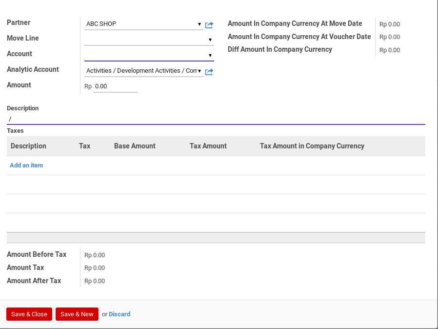

# Penjelasan

Informasi pada Bank Receipt dibagi menjadi beberapa area, diantaranya:

* [Header](#bagian-header)
* [Voucher Item](#bagian-detail)
* [Footer](#bagian-footer)
* Tab Notes
* Tab Accounting Information
* Tab Log
* Tab Policy

### <a name="bagian-header">HEADER</a>

#### <a name="field-name"># Bank Receipt</a>

Nomor dokumen bank receipt

#### <a name="field-company">Company</a>

Perusahaan pemilik dokumen bank receipt

#### Default Operating Unit

#TODO

#### Date

Tanggal transaksi

#### Period

Periode akuntansi terjadinya transaksi

#### Journal

Buku jurnal yang akan digunakan untuk mencatat penjurnalan bank receipt

#### Payment Mode

Metode penerimaan

#### Partner

Pihak penerima

#### Description

Keterangan utama transaksi. Isi field ini akan digunakan pada penjurnalan bank receipt di
sisi debit. Akan muncul di *general ledger*

#### Note

Catatan tambahan

### <a name="bagian-footer">FOOTER</a>

#### Total Voucher

Total penerimaan dalam mata uang yang sesuai dengan buku jurnal

#### Exchange Rate

Spot rate kurs

#### Total Voucher In Company Currency

Total penerimaan dalam mata uang perusahaan

### <a name="bagian-detail">DETAIL</a>

#### Partner

Pihak penerima

#### Move Line

Journal item yang akan direkonsiliasi

#### Account

Akun yang akan dikredit pada penjurnalan bank receipt

#### Analytic Account

#TODO

#### Amount

#TODO

#### Amount In Company Currency At Move Date

#TODO

#### Amount In Company Currency At Voucher Date

#TODO

#### Diff Amount In Company Currency

#TODO

#### Description
