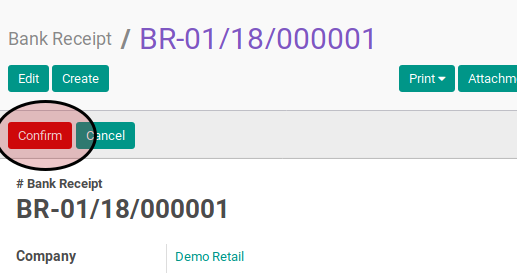

# Post Bank Receipt

1. Buka menu **Accounting -> Bank & Cash -> Bank Receipt**. Abaikan jika sudah berada
pada menu yang dimaksud.
2. Buka data bank receipt yang akan di-*posting*. Abaikan jika data sudah dibuka.
3. Klik tombol **Post** pada bagian atas-kanan form. Pop-up form berjudul **Post Voucher**
akan muncul

4. Isi **Date** pada pop-up form **Post Voucher**
5. Klik tombol **Post** pada bagian bawah-kiri pop-up form **Post Voucher**
