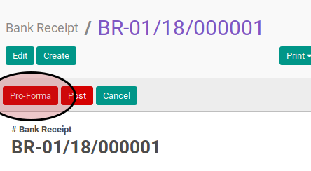

# Proforma Bank Receipt

## A. INPUT

* Data bank receipt yang akan dijadikan proforma harus memiliki status **Ready To Process**.

* User yang akan mengkonfirmasi harus memiliki akses untuk menjadikan proforma bank receipt.

## B. LANGKAH KERJA

1. Buka menu **Accounting -> Bank & Cash -> Bank Receipt**. Abaikan jika sudah berada
pada menu yang dimaksud.
2. Buka data bank receipt yang akan di-*proforma*. Abaikan jika data sudah dibuka.
3. Klik tombol **Proforma** pada bagian atas-kiri form.

## C. OUTPUT

* Status dari bank receipt akan berubah menjadi **Proforma**

