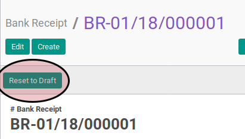

# Merestart Bank Receipt

1. Buka menu **Accounting -> Bank & Cash -> Bank Receipt**. Abaikan jika sudah berada
pada menu yang dimaksud.
2. Buka data bank receipt yang akan di-*restart*. Abaikan jika data sudah dibuka.
3. Klik tombol **Reset to Draft** pada bagian atas-kanan form.

