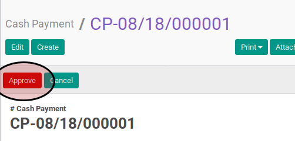

# Menyetujui Cash Payment

## A. INPUT

* Data cash payment yang akan disetujui harus memiliki status **Waiting for Approval**.

* User yang akan menyetujui harus memiliki akses untuk menyetujui cash payment.

## B. LANGKAH KERJA

1. Buka menu **Accounting -> Bank & Cash -> Cash Payment**. Abaikan jika sudah berada
pada menu yang dimaksud.
2. Buka data cash payment yang akan disetujui. Abaikan jika data sudah dibuka.
3. Klik tombol **Approve** pada bagian atas-kiri form.

## C. OUTPUT

* Status dari cash payment akan berubah menjadi **Ready To Process**

