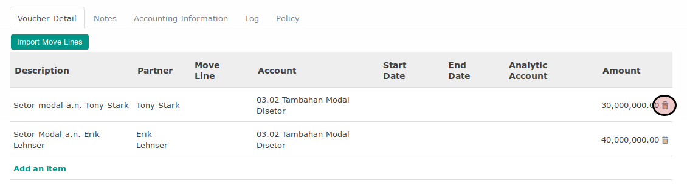

# Menghapus Voucher Line Pada Cash Payment

*(Instruksi kerja ini merupakan sub instruksi dari (1) [Membuat Cash Payment](./membuat.md), atau (2) [Memodifikasi Cash Payment](./memodifikasi.md). Instruksi kerja ini tidak bisa berdiri sendiri)*

## A. INPUT

*(Tidak ada instruksi khusus)*

## B. LANGKAH KERJA

1. Klik icon tempat sampah pada bagian kanan data **Voucher Line** yang akan dihapus.

2. Lanjutkan [langkah ke-12 Instruksi Kerja Membuat Cash Payment](./membuat.md#l12) atau [langkah ke-13 Instruksi Kerja Memodifikasi Cash Payment](./memodifikasi.md#l13).

## C. OUTPUT

*(Tidak ada instruksi khusus)*

