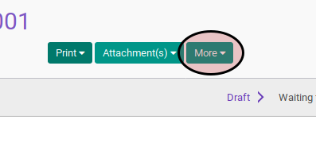

# Menghapus Cash Payment

## A. INPUT

* Data cash payment yang akan dihapus harus memiliki status **Draft**.

## B. LANGKAH KERJA

1. Buka menu **Accounting -> Bank & Cash -> Cash Payment**. Abaikan jika sudah berada pada menu yang dimaksud.
2. Buka data cash payment yang akan dihapus. Abaikan jika data sudah dibuka.
3. Klik tombol **More** pada bagian atas-kiri form.

4. Klik tombol **Delete** pada drop-down yang muncul pada tombol **More**.

5. Klik tombol **Ok** pada dialog konfirmasi penghapusan yang muncul.

## C. OUTPUT

* Data cash payment akan terhapus.

