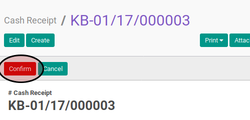

# Mengkonfirmasi Cash Receipt

## A. INPUT

* Data cash receipt yang akan dikonfirmasi harus memiliki status **Draft**.

* User yang akan mengkonfirmasi harus memiliki akses untuk mengkonfirmasi cash receipt.

## B. LANGKAH KERJA

1. Buka menu **Accounting -> Bank & Cash -> Cash Receipt**. Abaikan jika sudah berada
pada menu yang dimaksud.
2. Buka data cash receipt yang akan dikonfirmasi. Abaikan jika data sudah dibuka.
3. Klik tombol **Confirm** pada bagian atas-kiri form.

## C. OUTPUT

* Status dari cash receipt akan berubah menjadi **Waiting for Approval**

* Isian cash receipt sudah tidak bisa diubah
