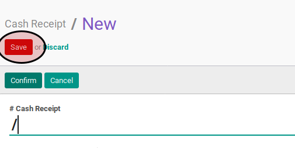

# Membuat Cash Receipt

1. Buka menu **Accounting -> Bank & Cash -> Cash Receipt**
2. Klik tombol **Create** pada bagian atas-kiri form.

3. Ubah **[# Cash Receipt](./penjelasan.md#field-name)** dengan penomeran yang dikehendaki. Biarkan berisi **/**
apabila menghendaki penomeran otomatis.
4. Ubah **[Company](./penjelasan.md#field-company)** jika dibutuhkan. Hanya terlihat pada implementasi multi-company. Harus diisi.
5. Isi **[Date](./penjelasan.md#field-date)**. Harus diisi.
6. Biarkan isian **[Period](./penjelasan.md#field-period)**.
7. Pilih **[Journal](./penjelasan.md#field-journal)**. Harus diisi.
8. Pilih **[Partner](./penjelasan.md#field-partner)** Tidak harus diisi.
9. Isi **[Total Voucher](./penjelasan.md#field-total-voucher)**. Harus diisi.
10. Isi **[Exchange Rate](./penjelasan.md#field-exchange-rate)**. Harus diisi.
11. Untuk setiap detail voucher, lakukan [prosedur input detail voucher](./membuat-detail.md).
12. <a name="langkah-12">Isi</a> **[Write-Off Account](./penjelasan.md#field-writeoff-account)** apabila nilai **[Amount Diff](./penjelasan.md#field-amount-diff)** tidak sama dengan 0.0 dan nominal tersebut ingin di-*write-off* ke akun tertentu.
13. Klik tombol **Save** pada bagian atas-kiri form.

